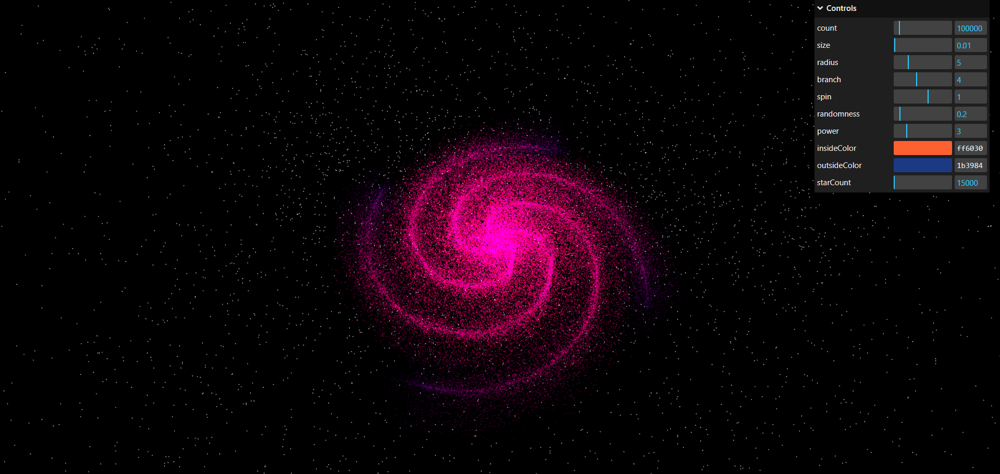

# 3D Galaxy Simulation with Three.js, GSAP, lil-gui, and React



This project is a 3D galaxy simulation built using Three.js, GSAP, React, and Vite. It allows users to explore and interact with a procedurally generated galaxy, with various parameters customizable via lil-gui.


## Features

- **3D Galaxy Rendering:** Explore a procedurally generated galaxy with stars, planets, and nebulae.
- **Customizable Parameters:** Use lil-gui to adjust parameters like star count, galaxy size, rotation speed, and more.
- **Smooth Animations:** GSAP powers smooth animations for camera movement, galaxy rotation, and other dynamic elements.
- **Built with Modern Tools:** Utilizes Three.js for 3D rendering, GSAP for animations, lil-gui for UI controls, and React with Vite for a fast and efficient development experience.


## Installation

To run the application locally, follow these steps:

#### 1. Clone the repository:

```bash
  git clone https://github.com/iakash22/3d-Galaxy.git
```

#### 2. Install dependencies:

```bash
  npm install
```

#### 3. Start the development server:

```bash
  npm run dev
```
#### 4. Open your browser and navigate to http://localhost:3000 to see the 3D text generator in action.


## Usage

**1.** When you open the application, a procedurally generated 3D galaxy will be displayed.

**2.** TUse lil-gui controls (available on the side of the screen) to adjust parameters like:
- Star Count: Increase or decrease the number of stars in the galaxy.
- Galaxy Size: Adjust the overall size of the galaxy.
- Rotation Speed: Control how fast the galaxy rotates.
- Colors and Effects: Customize colors, add effects like glow, and more

**3.** Interact with the galaxy by clicking and dragging to rotate the view, or use the scroll wheel to zoom in and out.


## Demo
**Link -**  https://3d-galaxy.netlify.app


## Technologies Used
 
- **Three.js:** A powerful 3D library for rendering 3D graphics in the browser.
- **GSAP:** A robust animation library used for animating galaxy elements and camera movements.
- **lil-gui:** A lightweight UI library for creating intuitive parameter controls.
- **React:** A popular JavaScript library for building user interfaces.
- **Vite:** A fast and modern build tool for front-end development.


## Project Structure

```

├── public
│   └── index.html          # HTML entry point
├── src
│   ├── components
│   │   └── Galaxy.js       # Component for rendering the 3D galaxy
│   ├── App.js              # Main App component
│   ├── main.js             # React entry point
│   ├── styles.css          # Global styles
│   └── assets              # Static assets like images and textures
├── package.json            # Project dependencies
└── vite.config.js          # Vite configuration

```

## Customization

You can customize the text appearance, camera angles, lighting, and animation effects by modifying the Three.js and GSAP settings in the **ThreeDText.js** component.
## Contributing

Contributions are welcome! 

Please feel free to submit a Pull Request or open an Issue if you have any suggestions or improvements.
